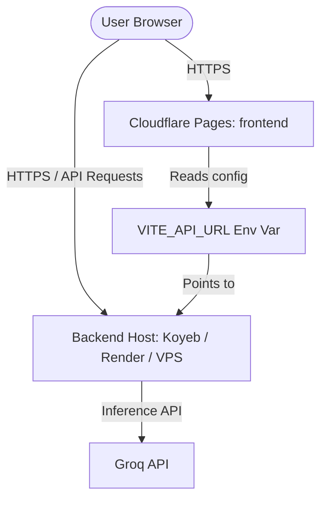

# ☁️ AstroAgent — Cloudflare Deployment Guide

This guide provides step-by-step instructions to deploy the **AstroAgent** frontend to **Cloudflare Pages** and configure the **FastAPI Backend** to work seamlessly under the Cloudflare network.

---

## 🗺️ Architecture Overview



### ⚡ Why Cloudflare Pages for Frontend?
- **Global CDN:** Lightning-fast asset delivery.
- **DDoS Protection:** Industry-leading security out of the box.
- **Easy SPA Routing:** Handled via the pre-configured `_redirects` rule.
- **Unlimited Free Bandwidth:** Standard on the Cloudflare Pages free tier.

### 🐍 Can the Python Backend run on Cloudflare Workers?
No. Cloudflare Workers run on a JavaScript V8 runtime. Although Cloudflare has experimental support for Python via Pyodide (WASM), it is extremely limited:
- It cannot compile complex native C extensions (like `ephem` used for birth chart astronomical calculations).
- It lacks full socket, threading, and filesystem APIs required by `langgraph` and `uvicorn`.

**Instead, we deploy the Python backend to Koyeb, Render, or a VPS, and route/secure it using Cloudflare DNS/Proxy.**

---

## 🛠️ Step 1: Deploy Frontend to Cloudflare Pages

### Option A: Deploy via GitHub (Recommended)
1. Push your repository to **GitHub**.
2. Log into the [Cloudflare Dashboard](https://dash.cloudflare.com).
3. Go to **Workers & Pages** → **Create Application** → **Pages** → **Connect to Git**.
4. Select your **AstroAgent** repository.
5. Configure the Build Settings:
   - **Framework Preset:** `Vite` (if not auto-detected)
   - **Build Command:** `npm run build`
   - **Build Output Directory:** `dist`
   - **Root Directory:** `/frontend`
6. Add the following **Environment Variable** in the build configuration:
   - Key: `VITE_API_URL`
   - Value: `https://your-astroagent-backend.koyeb.app` (replace with your deployed backend URL from Step 2)
7. Click **Save and Deploy**.

### Option B: Deploy via Wrangler CLI
If you want to deploy directly from your local terminal using the Cloudflare Wrangler CLI:

```bash
# 1. Install wrangler globally
npm install -g wrangler

# 2. Authenticate wrangler with your Cloudflare account
wrangler login

# 3. Build the frontend locally
cd frontend
npm run build

# 4. Deploy the build output (dist)
wrangler pages deploy dist --project-name=astroagent-frontend
```

---

## ⚙️ Step 2: Deploy and Configure the Backend

You can deploy the backend to **Koyeb** (recommended due to no cold starts) or **Render**.

### Option A: Koyeb (Docker Deployment)
1. Sign up/log into [Koyeb](https://www.koyeb.com).
2. Click **Create Service** → select **GitHub** → select your repo.
3. Koyeb will automatically detect the root `Dockerfile` we created.
4. Set the following environment variables in the Koyeb dashboard:
   - `GROQ_API_KEY` = `gsk_your_key`
   - `CORS_ORIGINS` = `https://astroagent-frontend.pages.dev` (your Cloudflare Pages domain, or `*` for open access)
   - `PORT` = `8000`
5. Deploy the service. Koyeb will build the Docker container and give you a public URL (e.g., `https://astroagent-xxxx.koyeb.app`).
6. *Optional:* Set up a Custom Domain in Koyeb and point your Cloudflare DNS CNAME record to the Koyeb domain with the Cloudflare Proxy (orange cloud) active.

### Option B: VPS + Cloudflare Tunnel (For Self-Hosting)
If you are running the backend on your own server or VPS, you can use a **Cloudflare Tunnel** to securely expose it without opening public ports.

1. Install `cloudflared` on your server:
   ```bash
   # Debian/Ubuntu
   curl -L --output cloudflared.deb https://github.com/cloudflare/cloudflared/releases/latest/download/cloudflared-linux-amd64.deb
   sudo dpkg -i cloudflared.deb
   ```
2. Log in to Cloudflare:
   ```bash
   cloudflared tunnel login
   ```
3. Create a tunnel:
   ```bash
   cloudflared tunnel create astroagent-backend
   ```
4. Configure routing (associate a subdomain you own with the tunnel):
   ```bash
   cloudflared tunnel route dns astroagent-backend api.yourdomain.com
   ```
5. Create a configuration file `config.yml` on the server:
   ```yaml
   tunnel: <TUNNEL_ID>
   credentials-file: /root/.cloudflared/<TUNNEL_ID>.json

   ingress:
     - hostname: api.yourdomain.com
       service: http://localhost:8000
     - service: http_status:404
   ```
6. Run the tunnel:
   ```bash
   cloudflared tunnel run astroagent-backend
   ```
7. Start your backend locally on the server using Docker or `python -m backend.app` on port 8000. Now all traffic to `api.yourdomain.com` is securely tunneled directly to your local FastAPI instance.

---

## 🔄 Single-Page Application (SPA) Routing on Cloudflare
A common issue with React SPAs is that refreshing the browser on a route like `/chat` results in a **404 Not Found** error because Cloudflare Pages tries to look for a physical file at `/chat/index.html`.

We have already resolved this by adding `frontend/public/_redirects` with the following rule:
```text
/*    /index.html   200
```
Vite will automatically copy this rule into the `dist/` directory on build (configured via `publicDir: 'public'` in `vite.config.ts`), ensuring Cloudflare Pages serves `index.html` for all client-side routes.

---

## 🧪 Verifying the Deployment

Once both components are live, perform these smoke tests:

1. **Verify CORS Configuration:**
   Make sure the backend is responding with correct CORS headers when request comes from Cloudflare Pages.
   ```bash
   curl -I -X OPTIONS https://your-astroagent-backend.koyeb.app/chat \
     -H "Origin: https://astroagent-frontend.pages.dev" \
     -H "Access-Control-Request-Method: POST"
   ```
   *Expected Response:* `Access-Control-Allow-Origin: https://astroagent-frontend.pages.dev` (or `*`).

2. **Test End-to-End Chat:**
   Open your deployed Pages URL (e.g. `https://astroagent-frontend.pages.dev`), open DevTools Network tab, and verify that chat messages send successfully to your backend and response tokens are streamed back via Server-Sent Events (SSE).
